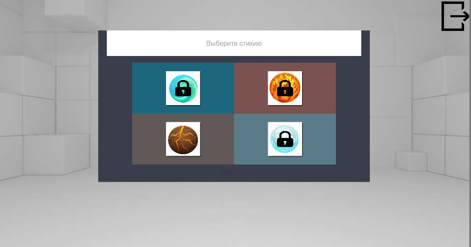
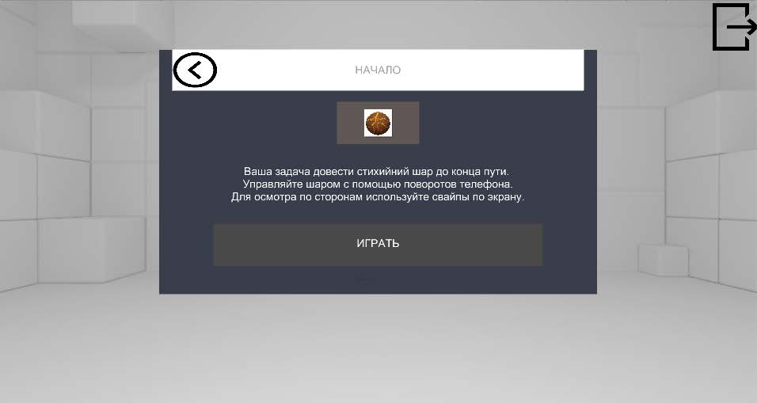
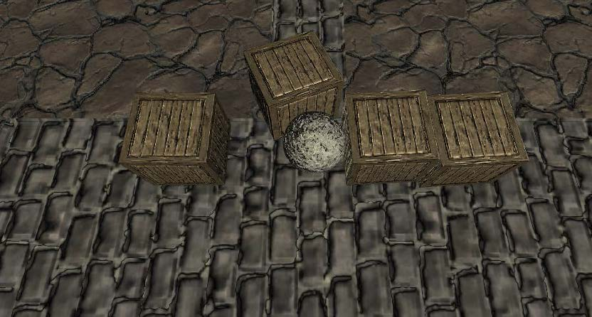
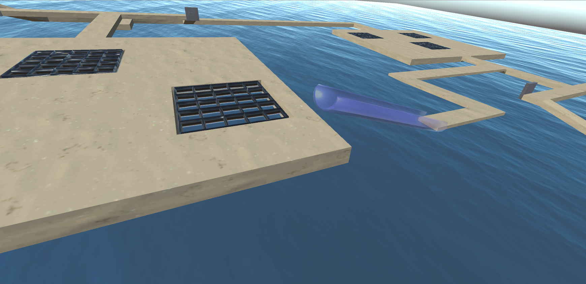
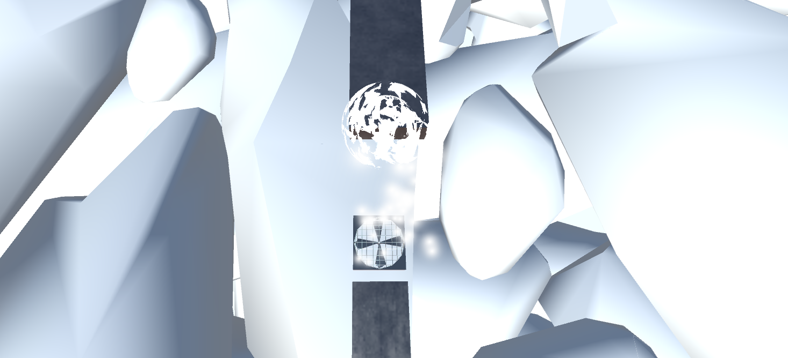
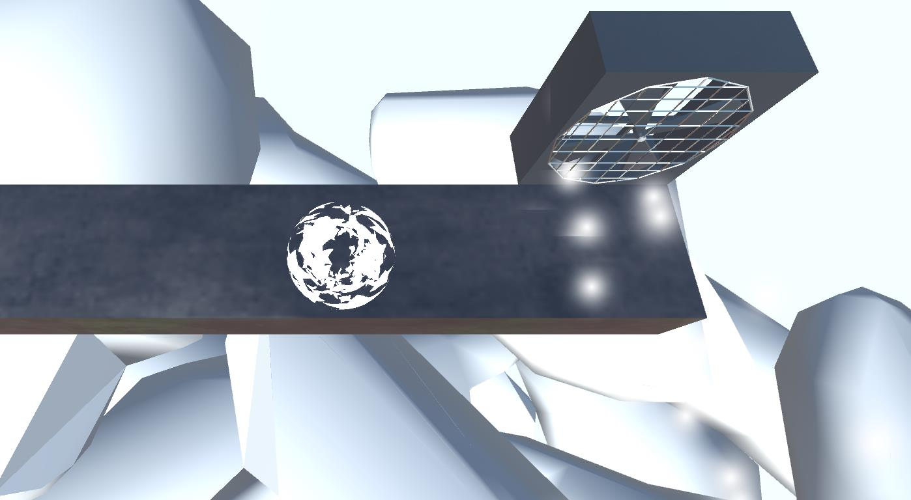
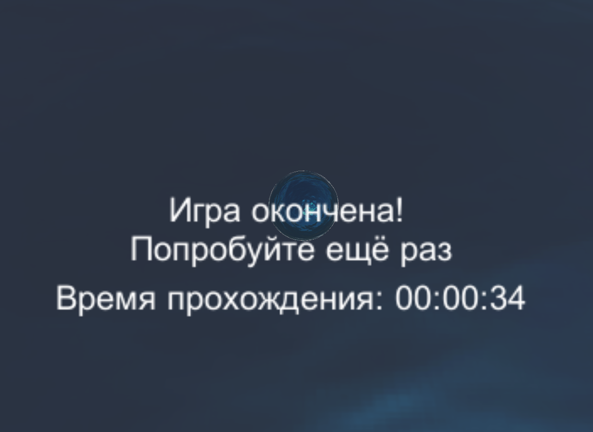
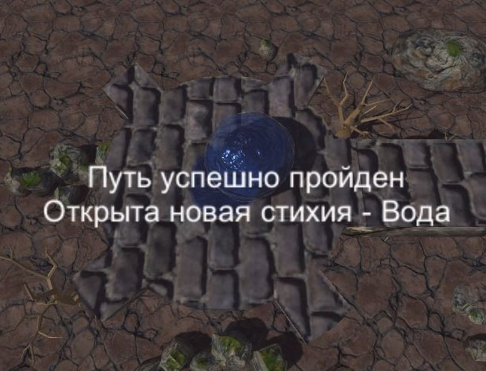

# GyroBall

Мобильное приложение – игра для с использованием механики акселерометра. С помощью поворотов смартфона необходимо упрявлять стихийным шаром, проходить тематические локации и справляться с препятствиями с помощью силы стихий. При запуске приложения через ПК возможно стандартное управление кнопками.

---

# Images

---

# Tech
* C#
* 3D modeling
* Unity 3D
---
# Developers
* Баканова М.В.
* Новаков Н.Ю.
---

